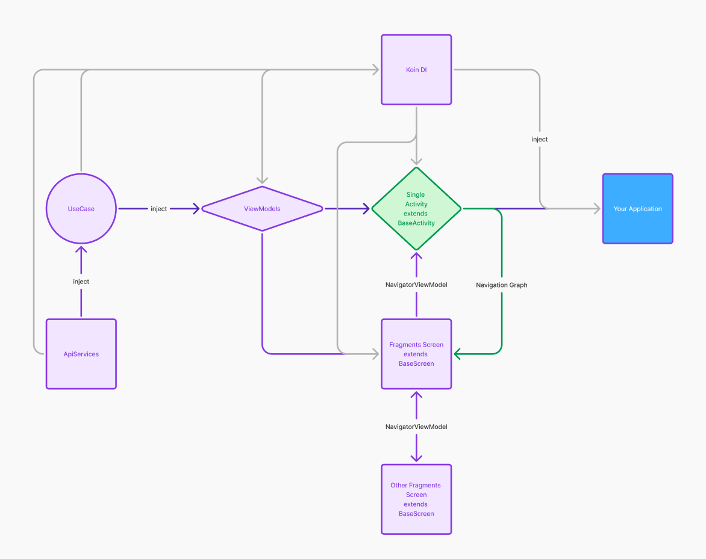

# Last version: v2.0.0

# To use: implementation("com.github.koai-dev:base:$lastVersion")

# Check module appp for example or 
https://github.com/koai-dev/kingofenglish

# Download and rate me 5 stars for this demo app: https://play.google.com/store/apps/details?id=com.english.vocab.game

# Thank you very much 🥰

### Application Structure
use this flow to implement your application

